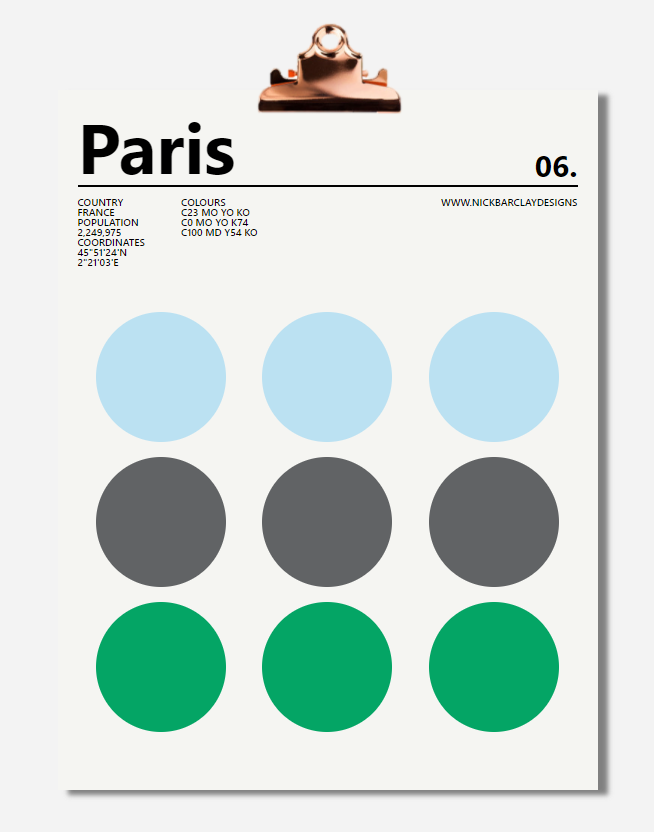
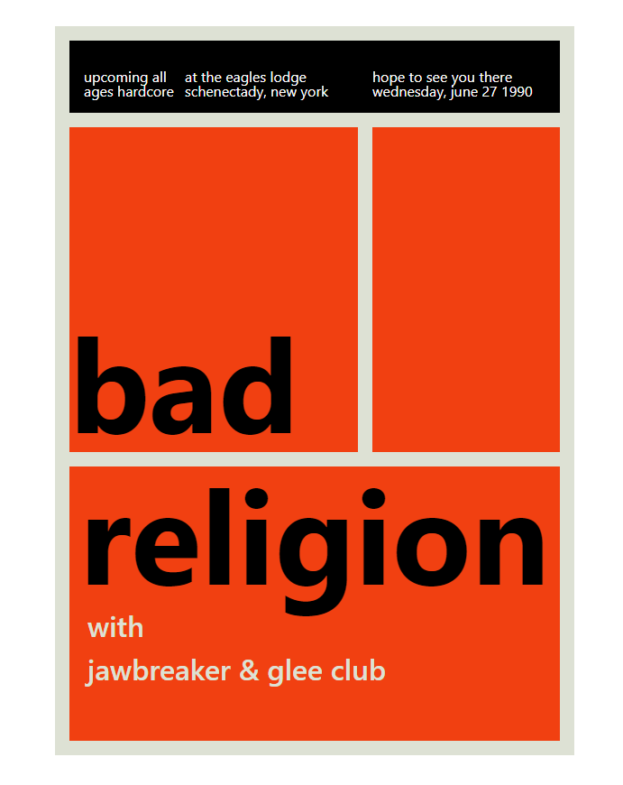
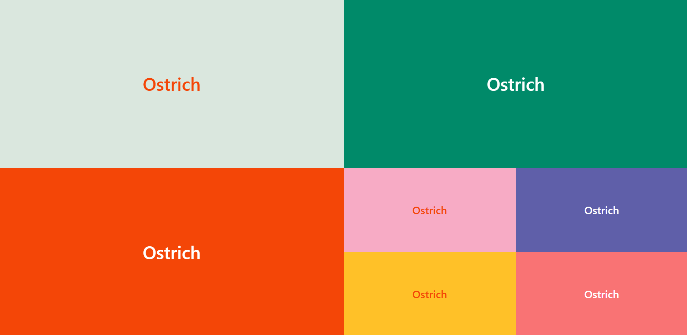
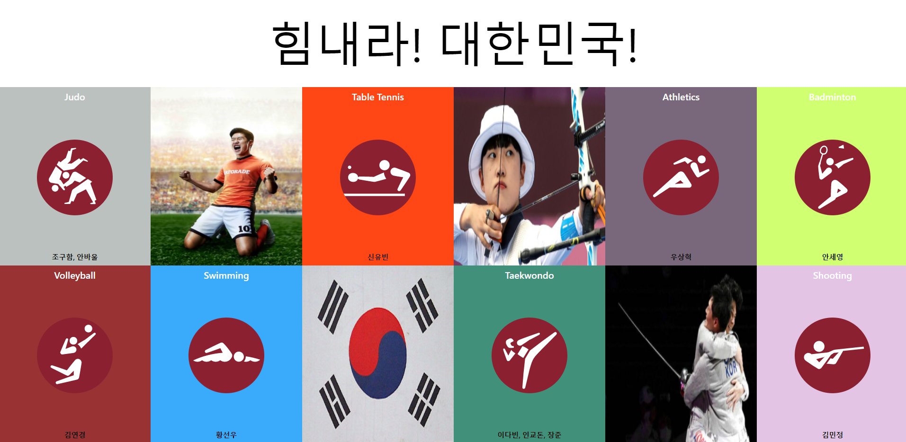
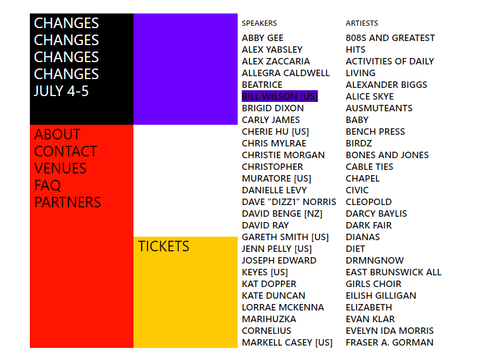
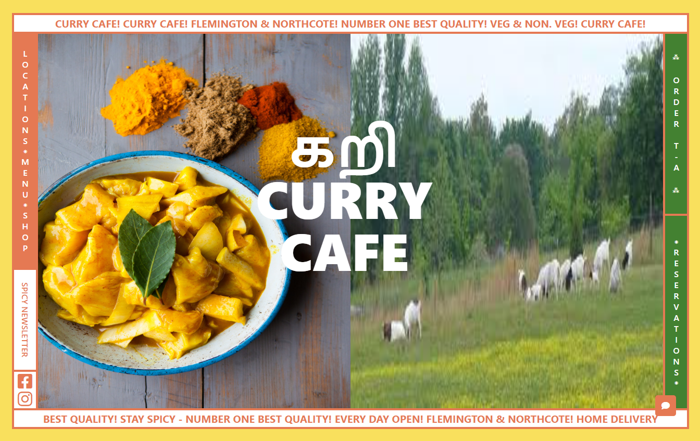
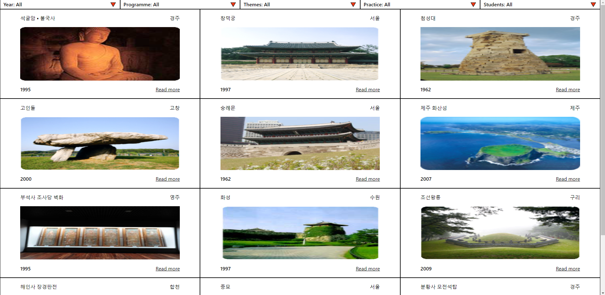
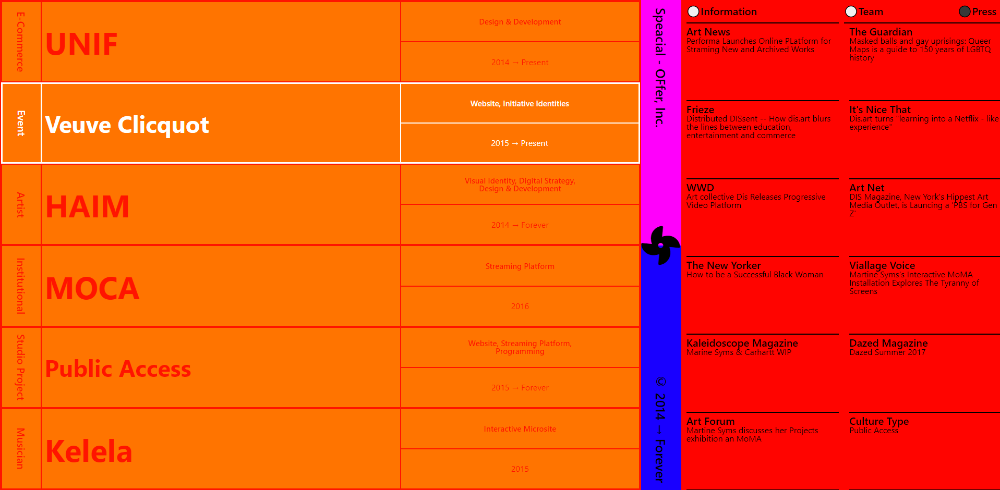
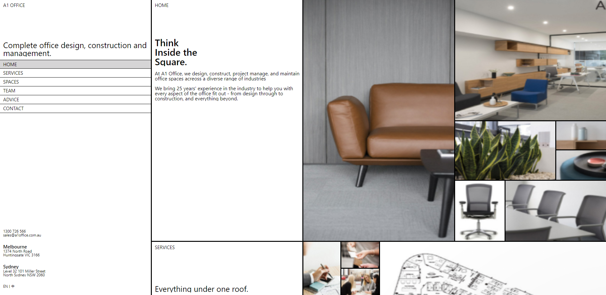

# Nomad_CSS_Challenge
In this challenge, I cloned a website design that used 'grid'(css) a lot.

## Day2

## Day3

## Day4

## Day5

## Day8

## Day9 & Day10

## Day11

## Day12 & Day13

## Day14

